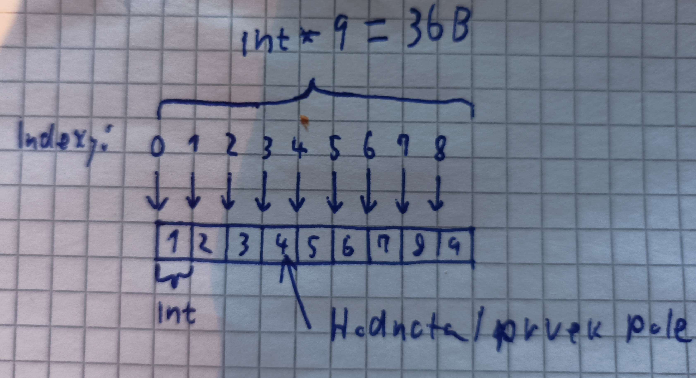
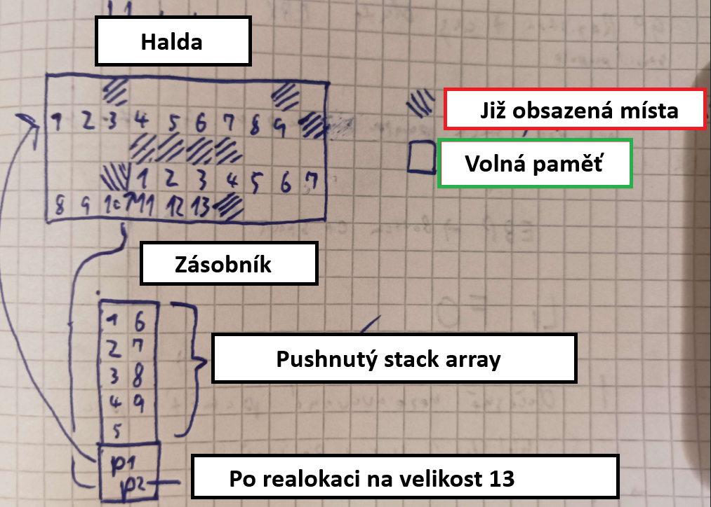

## Co je vlastně to pole
Pole jsou způsob jak uložit několik hodnot do jedné proměnné.
Dále u pole platí že jsou data uloženy hned za sebou, takže jsou **konsekutivní** (Po sobě jdoucí).
proměnná **pole** je pointer, který ukazuje na první hodnotu prvku

Z řazení datových typů také víme že jsou data homogenní, čili stejného datového typu.


## Jak teda vypadá Přístup k prvkům pole a pointerová aritmetika?
jestli víme že adresa prvního prvku je začátek pole tak k prvnímu poli se dostaneme takto
```c
int pole[9] = {1,2,3,4,5,6,7,8,9};
// představme si že prvke 1 má adres 0x0000 (hexadecimalne)
// příklad pointerové aritmetiky
int hodnotaPrvnihoPrvku = *(pole + 1); // 2
```

**Dále díky homogenitě a konsekutivnosti(jsou za sebou, žádná hodnota není mezi nimi) dat víme že další prvek bude**
```c
int pole[9] = {1,2,3,4,5,6,7,8,9};
// představme si že prvke 1 má adres 0x0000 (hexadecimalne)
// další prvek tak má adresu 0x0004 = 0x0000 + 0x0004
int hodnotaPrvnihoPrvku = *( (int*) ((char*)pole + 1 * sizeof(int)) ); // 2
```
nelekejte se, tohle všechno za nás udělá compiler a stačí to napsat takto:
```c
int pole[9] = {1,2,3,4,5,6,7,8,9};
// představme si že prvke 1 má adres 0x0000 (hexadecimalne)
// další prvek tak má adresu 0x0004 = 0x0000 + 0x0004
int hodnotaPrvnihoPrvku = *(pole+1); // 2
```
Důležité je si odnést že kdyby byly různé datové typy nebo kdyby bylo pole rozděleno do několika segmentů nešlo by pole používat.

ještě více zkrácený výraz, který se používá nejčastěji je tento:
u tohoto zápisu si musíme uvědomit že pole se **indexuje od 0**
```c
int pole[9] = {1,2,3,4,5,6,7,8,9};
// představme si že prvke 1 má adres 0x0000 (hexadecimalne)
// další prvek tak má adresu 0x0008 = 0x0000 + 0x0004*2
int hodnotaPrvnihoPrvku = pole[2] // 3
```

## Další možnosti polí
začnu s analogii, zásobník si můžeme představit jako na sobě položené talíře, v tomto případě jsou talíře data, která přidáváme do zásobníku. Když se podíváme na talíře poskládané na sobě a ty co používáme jsou přímo nahoře, takže k nim máme rychlý přístup.
Naopak halda se dá představit ... no jako halda smetí všechno náhodně bez ladu a skladu, a věci co hledáme přímo nevidíme a trvá nám dlouho je najít.

**Tak Proč by někdo používal haldu??**
v reálném světe máme jen určitou výšku do které můžeme skládat talíře na sebe než se nedostaneme dále. Tento stejný problém má i zásobník, je omezen tím kolik nám operační systém přidělil paměti (konkrétně RAM).

A halda je výrazně větší a dokáže tedy uložit více věcí, dat, a navíc se dá zvětšit návozem více hlíny/odpadků/dat

**Proč není zásobník větší než halda?**
Aby zásobník mohl být tak rychlý jak je, tak vyžaduje optimalizaci compilerem, která není možná v moment, kdy potřebujeme haldu dynamicky měnit.
### Pole v zásobníku
- je třeba vědět jeho velikost předem.
- rychlejší přístup/ přidání do zásobníku (data se pushnou do zásobníku)
- **může** zabírat velikou část zásobníku (hodně hodnot, může dojít k přetečení zásobníku)
- nelze dynamicky měnit
```c
int main(void)
{
	int pole[9]; // pole je v zásobníku
}
```

### Pole na haldě
- není třeba vědět velikost
- pomalejší alokace (allocator musí projet hladu najít dostatečně velké místo, a uložit data viz obr)
- pomalejší přístup (přes pointer,který je v zásobníku)
- lze změnit velikost (ale často se pole musí přesunout na jiné místo v haldě)
```c
int main(void)
{ 
	int* pole = malloc(sizeof(int) * 9);
	// použití
	// uvolnění paměti a zakotvení
	free(pole); // můžeme si představit jako smazání čísel 1-9 z obrázku
	pole = null; // už nebude ukaovat na místo v haldě abychom jej omylem nepoužili
}
```
proměnná **pole** je statická(v **zásobníku**) proměnná, která odkazuje na dynamickou proměnnou `(malloc(sizeof(int) * 9 ))` (na **haldě**)




## Dvojrozměrná pole

### Statické 
Statické 2 rozměrné pole se chová stejně jako jednorozměrné pole.

```c
#define ROWS 4
#define COLS 3
int p [ROWS][COLS] = {{1,2,3}, {4,5,6}, {7,8,9}, {10,11,12}};
for (int i = 0; i < COLS; i++)
{
	for (int j = 0; j < ROWS; j++)
	{
	
	printf(" |%d|", p[i][j]);
	}
	printf("\n");
}

// Přístup
p[1][2] = 6; // 6 se změní na 6
// hodnota přes pointerovou aritmetiku: *(p + COLS * 1 + 2)


// logické zobrazení
    0   1   2   3
 0 |1| |2| |3| |4|
 1 |4| |5| |6| |7|
 2 |7| |8| |9| |10|
// fyzická struktura dat
&p -> |1| |2| |3| |4| |5| |6| |7| ...

```
### Dynamické


```c

#define ROWS 10
#define COLS 1

int* pole[ROWS];

for (int i = 0; i < ROWS; i++)
{
	pole[i] = (int*) malloc(sizeof(int) * (COLS+i));

	for (int j = 0; j < COLS+i; j++)
	{
		pole[i][j] = j;
	}

}
for (int i = 0; i < ROWS; i++)
{
	for (int j = 0; j < COLS+i; j++)
	{
		printf(" %d ", pole[i][j]);
	}
printf("\n");
}

```


```c
#define ROWS 3

#define COLS 2

int **p = (int**) malloc(sizeof(int*) * ROWS);

for (int i = 0; i < ROWS; i++)
{
p[i] = (int*) malloc(sizeof(int) * COLS);
	for (int j = 0; j < COLS; j++)
	{
		p[i][j] = 42;
	}
}

for (int i = 0; i < COLS; i++)
{
	for (int j = 0; j < ROWS; j++)
	{
		printf(" %d ", p[j][i]);
	}
printf("\n");
}
```


## Pole v jave
```java
int[] pole = new int[3] {1,2,3};
```

int[] je referenční datový typ
klíčové slovo **new** alokuje místo na haldě

## Array list
je datová struktura postavená na poli, která navíc od pole umožňuje zvětšovat svou velikost

```Java
        ArrayList<Integer> list = new ArrayList<>(20); // 20 - ocekávaná velikost. Může pořád vyrůst ještě více
        list.add(4);  // přidáme na konec (když není prázdný)
        list.addFirst(2);  // přidat na začátek
        list.remove(2);  // odstraní podle indexu
        list.contains(4);  // vrátí true, pokud je v listu hodnota 4
        list.size();  // vrací počet hodnot v poli
        System.out.println(list.get(1)); // vypíše druhou hodnotu
```
